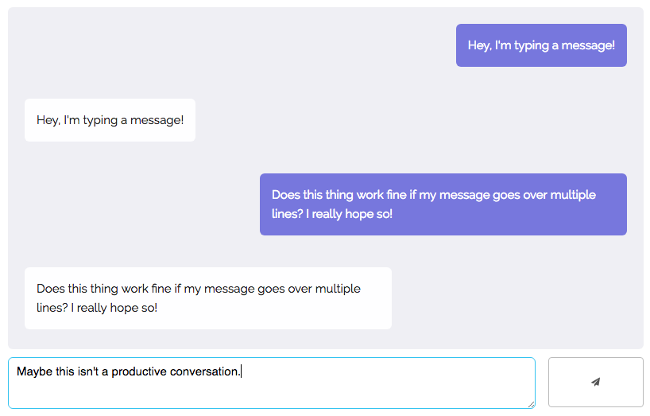

# Elm Chat
#### A simple chat app using Elm.

#### _Try it out [here](http://elm-chat.s3-website.eu-west-2.amazonaws.com/)!_

[Elm](http://elm-lang.org/) is a programming language which compiles to HTML and JavaScript. 
Elm's advantages include an intuitive functional reactive programming style, a no-runtime-error guarantee, 
and a time-travelling debugger.

This application:
* Connects to a WebSocket server;
* Sends and receives messages;
* Displays all new messages onscreen; and
* Automatically scrolls to display new messages

The [WebSocket](https://github.com/elm-lang/websocket) and [Dom](https://github.com/elm-lang/dom)
libraries are used, both belonging to the elm-lang namespace.

[Skeleton](http://getskeleton.com) and [Normalize](https://necolas.github.io/normalize.css/) are
both used for the app's interface.

